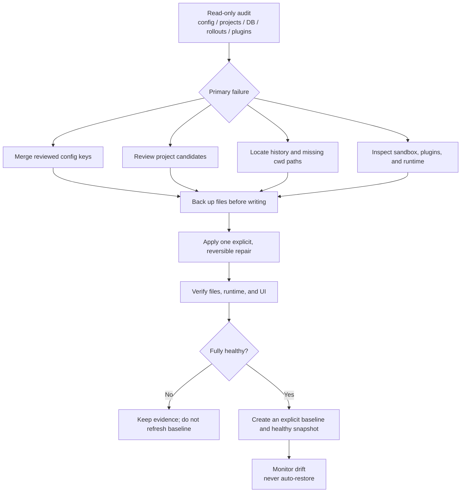

# Codex Windows State Recovery

[中文](README.md) | [English](README.en.md)

When a Codex update or unexpected exit makes projects, conversations, or
settings disappear, the data may still be on disk. So, about this problem,
I designed this Skill and fixed it through a codex general task. 
This skill's gonna check the local files and the database first, 
and then pick a recovery method based on the actual problem.

It covers:

- an empty, damaged, unparseable, or regenerated `config.toml`;
- projects disappearing from the sidebar;
- conversations missing from the UI while SQLite or rollout files still exist;
- SQLite corruption that prevents startup or breaks local history;
- repeated Windows setup or sandbox prompts after an update;
- bundled plugin, manifest, or runtime paths that no longer work;
- creating a verified backup for later inspection or manual recovery.

> [!IMPORTANT]
> The Skill starts read-only. It never overwrites configuration, projects, or
> databases automatically. Any write requires explicit confirmation and a
> backup of the original file.

## Platform support

| Platform | Support |
|---|---|
| Windows 10/11 | Full scripts, project recovery, Guard, healthy snapshots, and manual restore |
| macOS | Manual backup, read-only checks, history triage, and emergency SQLite recovery |

The Windows scripts depend on Appx, Task Scheduler, and PowerShell. They do not
run on macOS. macOS users should follow the manual guide below and must not
install the Windows Guard.

## Design goals

1. **Check before changing**: inspect files, databases, rollouts, logs, and real
   project directories before choosing a fix.
2. **Keep changes small**: merge configuration keys and approved projects
   instead of replacing entire state files.
3. **Make recovery reversible**: back up first, replace atomically, and restore
   the original state if a write fails.
4. **Survive updates**: keep durable user data separate from replaceable
   packages, caches, and version-specific paths.
5. **Require confirmation**: audits are read-only; baseline refresh and restore
   are explicit actions.
6. **Verify at every layer**: check files, runtime behavior, and the UI. Unit
   tests do not replace a restart test.

## How it works



Detailed references:

- [`references/state-layout.md`](references/state-layout.md)
- [`references/recovery-routing.md`](references/recovery-routing.md)
- [`references/config-merge-policy.md`](references/config-merge-policy.md)
- [`references/adversarial-checklist.md`](references/adversarial-checklist.md)
- [`references/macos-recovery.en.md`](references/macos-recovery.en.md)

## macOS: back up first, then identify the damaged layer

Codex uses `$CODEX_HOME` as its data directory on macOS. When that variable is
not set, the default is `~/.codex`. The commands in this section only read or
back up data.

### 1. Quit Codex and create a backup

Quit Codex from the application menu, then open Terminal:

```bash
CODEX_DIR="${CODEX_HOME:-$HOME/.codex}"
BACKUP_DIR="$HOME/Desktop/codex-backup-$(date +%Y%m%d-%H%M%S)"

mkdir -p "$BACKUP_DIR"
ditto "$CODEX_DIR" "$BACKUP_DIR/.codex"
printf 'Backup: %s\n' "$BACKUP_DIR/.codex"
```

The backup may contain sign-in data, conversation content, and local paths. Do
not upload or publish the full directory.

### 2. Check configuration, databases, and session files

```bash
CODEX_DIR="${CODEX_HOME:-$HOME/.codex}"

python3 -m json.tool \
  "$CODEX_DIR/.codex-global-state.json" >/dev/null &&
  echo "global state: ok"

for db in \
  "$CODEX_DIR/state_5.sqlite" \
  "$CODEX_DIR/sqlite/state_5.sqlite"
do
  if [ -f "$db" ]; then
    printf '%s: ' "$db"
    sqlite3 "$db" 'PRAGMA quick_check;'
  fi
done

find \
  "$CODEX_DIR/sessions" \
  "$CODEX_DIR/archived_sessions" \
  -type f -name 'rollout-*.jsonl' 2>/dev/null | wc -l
```

If `state_5.sqlite` and rollout files still exist while the sidebar is empty,
treat the problem as a UI or indexing failure first. Do not delete the database
or bulk-edit `project-order`.

### 3. Codex cannot start because SQLite is corrupt

Quarantine a database and its `-wal` and `-shm` sidecars only when the logs name
that database as corrupt and a complete backup already exists. Never delete the
files in place.

See [`references/macos-recovery.en.md`](references/macos-recovery.en.md) for the
full commands, configuration merge rules, and restart checklist.

## Windows: install the Skill

Requirements:

- Windows 10 or Windows 11;
- Windows PowerShell 5.1 or PowerShell 7;
- Python 3.11 or later (`tomllib` is used);
- Codex Desktop has been run at least once and `%USERPROFILE%\.codex` exists.

Clone the repository into the Codex Skills directory:

```powershell
git clone `
  https://github.com/MrH0v0/repair-codex-windows-state.git `
  "$env:USERPROFILE\.codex\skills\repair-codex-windows-state"
```

Reopen Codex, then invoke it with:

```text
Use $repair-codex-windows-state to inspect this Windows Codex update issue.
Start read-only and do not restore anything automatically.
```

## Quick start: read-only audit

### 1. Audit the current state

```powershell
python "$env:USERPROFILE\.codex\skills\repair-codex-windows-state\scripts\audit_codex_state.py" `
  --output "$env:TEMP\codex-state-audit.json"
```

The audit checks:

- `config.toml` bytes, TOML syntax, and important runtime references;
- project structure, `project-order`, and the chat process registry;
- `PRAGMA quick_check` and thread counts in both SQLite databases;
- rollout counts, source categories, and missing `cwd` paths;
- bundled plugin manifests and stable `latest` targets;
- installed Guard baseline and state metadata.

Exit code `1` means degraded or critical evidence was found. It does not mean
the script itself failed, and it does not authorize a repair.

### 2. Audit configuration candidates

```powershell
python "$env:USERPROFILE\.codex\skills\repair-codex-windows-state\scripts\audit_config_candidates.py" `
  --search-root "$env:USERPROFILE\.codex" `
  --output "$env:TEMP\codex-config-candidates.json"
```

Sensitive values are hidden. Candidate scores only narrow the review set; they
are never a reason to overwrite the current configuration.

### 3. Find sidebar project candidates

```powershell
python "$env:USERPROFILE\.codex\skills\repair-codex-windows-state\scripts\discover_project_candidates.py" `
  --output "$env:TEMP\codex-project-candidates.json"
```

The script distinguishes:

- existing Git workspaces with sidebar-log evidence;
- low-confidence paths found only in rollout `cwd`;
- broad roots such as the user home, Desktop, or Documents;
- temporary Codex worktrees;
- projects already present in the sidebar.

It generates candidates only. It does not modify global state.

### 4. Check the chat process registry

```powershell
& "$env:USERPROFILE\.codex\skills\repair-codex-windows-state\scripts\Repair-CodexChatProcessRegistry.ps1" `
  -OutputPath "$env:TEMP\codex-chat-process-registry.json"
```

The default action is inspection only. Reset is allowed only when the file is
empty or all NUL and the schema in the **currently installed package** has been
confirmed as an array of process records:

```text
-ConfirmReset -ConfirmedCurrentSchemaArray
```

The script preserves the original bytes and a replacement backup, then writes
an empty array atomically. It never fabricates old process IDs.

## Recover sidebar projects incrementally

Put manually approved projects in a manifest:

```json
{
  "projects": [
    {
      "name": "Example",
      "rootPath": "C:\\absolute\\path\\to\\Example",
      "createdAt": 1760000000000
    }
  ]
}
```

The default mode is a dry run:

```powershell
python "$env:USERPROFILE\.codex\skills\repair-codex-windows-state\scripts\merge_recovered_projects.py" `
  --state "$env:USERPROFILE\.codex\.codex-global-state.json" `
  --config "$env:USERPROFILE\.codex\config.toml" `
  --manifest ".\approved-projects.json" `
  --output ".\project-merge-dry-run.json"
```

Review the diff, stop Codex, and create an independent backup before applying:

```powershell
python "$env:USERPROFILE\.codex\skills\repair-codex-windows-state\scripts\merge_recovered_projects.py" `
  --state "$env:USERPROFILE\.codex\.codex-global-state.json" `
  --config "$env:USERPROFILE\.codex\config.toml" `
  --manifest ".\approved-projects.json" `
  --apply `
  --confirm-codex-stopped `
  --output ".\project-merge-applied.json"
```

`--trust-projects` is a separate security decision and is disabled by default.
Temporary Codex worktrees are rejected. Broad roots such as the user home,
Desktop, or Documents also require `--allow-broad-roots`, which is not
recommended.

## Optional: install the persistent Guard

Create a baseline only after the current machine passes
[`references/adversarial-checklist.md`](references/adversarial-checklist.md):

```powershell
& "$env:USERPROFILE\.codex\skills\repair-codex-windows-state\scripts\Install-CodexRecoveryGuard.ps1" `
  -ConfirmInstall
```

The installer:

- backs up an existing Guard and scheduled task;
- installs detection, snapshot, and manual restore scripts;
- strictly validates configuration, project structure, the chat process
  registry, both databases, and relevant plugin caches;
- creates an explicit schema v2 baseline;
- creates a Limited scheduled task that runs every 30 minutes with
  `IgnoreNew`;
- restores the old scripts, baseline, and task if installation fails.

Guard behavior:

- missing baseline is an error; current state is never adopted automatically;
- any thread-count decrease is a drift warning;
- a decrease above 5% of baseline is critical;
- recoverable snapshots are created only for healthy state;
- degraded or critical state preserves evidence without changing
  last-known-good;
- the plugin baseline includes only valid installed or explicitly enabled
  caches;
- automatic restore is never performed.

Integration with the separate `codex-windows-fast-patch` Skill requires:

```text
-EnableFastPatchIntegration
```

The generic state Guard works without that Skill.

### Validate or restore

Validation is the default:

```powershell
& "$env:USERPROFILE\.codex\maintenance\update-guard\Restore-CodexLastHealthy.ps1" `
  -ValidateOnly
```

Restore only after reviewing the files that will be replaced:

```powershell
& "$env:USERPROFILE\.codex\maintenance\update-guard\Restore-CodexLastHealthy.ps1" `
  -ConfirmRestore
```

The restore script validates the allowed paths, manifest, size, SHA-256, TOML,
JSON, and SQLite files. It stops the current Codex package process, preserves a
pre-restore copy, removes stale WAL/SHM files, replaces files atomically,
rolls back on failure, and relaunches the current package AUMID.

### Remove the automation

```powershell
& "$env:USERPROFILE\.codex\skills\repair-codex-windows-state\scripts\Uninstall-CodexRecoveryGuard.ps1" `
  -ConfirmUninstall
```

The uninstaller removes the scheduled task and executable scripts while keeping
the baseline, reports, and recovery snapshots for later inspection.

## Script reference

| Script | Default behavior | Write requirement |
|---|---|---|
| `audit_codex_state.py` | Read-only state audit | Writes only to an explicit `--output` |
| `audit_config_candidates.py` | Read-only, redacted candidate audit | Writes only to an explicit `--output` |
| `discover_project_candidates.py` | Read-only project discovery | Writes only to an explicit `--output` |
| `Repair-CodexChatProcessRegistry.ps1` | Read-only inspection | Two explicit confirmation switches |
| `merge_recovered_projects.py` | Dry run | `--apply --confirm-codex-stopped` |
| `codex_update_guard.py` | Detect, snapshot healthy state, or preserve evidence | Baseline refresh is explicit |
| `Invoke-CodexUpdateGuard.ps1` | Windows wrapper | Passes explicit switches through |
| `Invoke-CodexUpdateMaintenance.ps1` | Scheduled Guard entry point | Fast-patch integration is disabled by default |
| `Restore-CodexLastHealthy.ps1` | Validation only | `-ConfirmRestore` |
| `Install-CodexRecoveryGuard.ps1` | Refuses installation | `-ConfirmInstall` |
| `Uninstall-CodexRecoveryGuard.ps1` | Refuses removal | `-ConfirmUninstall` |

## Security model and non-goals

The Windows workflow assumes the current Windows user account is trusted.
SHA-256 detects accidental corruption and snapshot drift; it does not defend
against an attacker who controls the account and can alter both a file and its
manifest.

The project does not:

- bypass Windows security or organization policy;
- modify a signed MSIX package, ASAR, or native host;
- guess or recover credentials;
- create projects automatically from every historical `cwd`;
- treat a weaker sandbox as a general repair;
- promise compatibility with private state schemas across all Codex releases.

Run a read-only audit after an update. If state is healthy and the failure is
clearly inside the application package, use a separate, version-gated,
reversible package-patch workflow.

## Development and validation

Run the Python tests:

```powershell
python -m unittest discover -s tests -v
```

Compile all Python files:

```powershell
python -m compileall -q scripts tests
```

Parse the PowerShell scripts with Windows PowerShell 5.1:

```powershell
Get-ChildItem .\scripts\*.ps1 | ForEach-Object {
  $parseTokens = $null
  $parseErrors = $null
  [void][System.Management.Automation.Language.Parser]::ParseFile(
    $_.FullName,
    [ref]$parseTokens,
    [ref]$parseErrors
  )
  if ($parseErrors) {
    $parseErrors
    throw "PowerShell parse failed: $($_.Name)"
  }
}
```

Tests must use a temporary Codex Home and must not read or write the real
`%USERPROFILE%\.codex`.

## Before publishing a release

- run the full fault-injection test suite;
- run install, detection, validation-only restore, and uninstall in a
  disposable Windows user environment;
- verify that the repository contains no user paths, configuration backups,
  databases, logs, task IDs, or credentials;
- recheck state schemas, process discovery, AUMID, and plugin cache layout
  against new Codex package versions;
- publish a release only after every applicable check passes.

## License

This project is licensed under the [MIT License](LICENSE).

Copyright (c) Codex Windows Recovery contributors.
