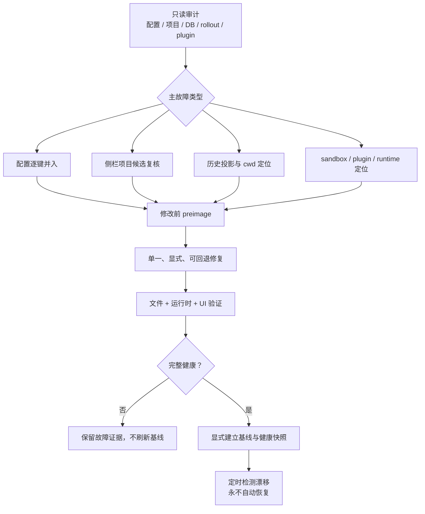

# Codex Windows State Recovery

面向 Codex Desktop for Windows 的证据驱动型状态诊断、恢复与持久化
Skill。

当一次 Store/MSIX 更新、异常退出、配置重建或缓存漂移导致以下现象时，
本项目提供一条可审计、可回退、默认只读的修复路径：

- `config.toml` 变空、被 NUL 字节填充、无法解析或被重新生成；
- 侧栏项目全部或部分消失；
- 任务历史在 UI 中不可见，或两套 SQLite 投影出现异常差异；
- rollout 仍存在，但原工作目录已经移动或丢失；
- `process_manager\chat_processes.json` 损坏并反复产生通知解析错误；
- 更新后反复出现 Windows 设置或 sandbox 提示；
- bundled plugin 的 `latest`、manifest 或绝对 runtime 路径失效；
- 需要建立 last-known-good 基线、健康快照和人工恢复能力。

> [!IMPORTANT]
> 本 Skill 不会把“当前能启动”自动认定为健康，也不会自动恢复配置、
> 项目或数据库。写入操作必须显式确认，并在修改前保留 preimage。

## 设计目标

1. **证据优先**：先验证原始文件、数据库、rollout、日志和真实目录，再
   选择修复流。
2. **最小修改**：配置按键并入；项目按审核后的 manifest 增量恢复；不做
   无关重写。
3. **可回退**：写入前备份，原子替换，中途失败自动恢复 preimage。
4. **更新耐受**：将用户耐久状态与可替换的应用包、缓存和版本耦合路径
   分离。
5. **默认安全**：审计只读、报告脱敏、baseline 与 restore 都需要显式
   动作。
6. **可验证**：同时检查文件层、运行时层和 UI 层；单元测试不能替代
   重启后的界面验收。

## 工作原理



状态层说明、证据优先级和恢复路由分别见：

- [`references/state-layout.md`](references/state-layout.md)
- [`references/recovery-routing.md`](references/recovery-routing.md)
- [`references/config-merge-policy.md`](references/config-merge-policy.md)
- [`references/adversarial-checklist.md`](references/adversarial-checklist.md)

## 安装 Skill

要求：

- Windows 10 或 Windows 11；
- Windows PowerShell 5.1 或 PowerShell 7；
- Python 3.11+（使用标准库 `tomllib`）；
- 已运行过 Codex Desktop，并存在 `%USERPROFILE%\.codex`。

将仓库克隆到 Codex Skills 目录：

```powershell
git clone `
  https://github.com/MrH0v0/repair-codex-windows-state.git `
  "$env:USERPROFILE\.codex\skills\repair-codex-windows-state"
```

重新打开 Codex 后，可直接请求：

```text
使用 $repair-codex-windows-state 审计这台 Windows 电脑上的 Codex
更新后状态异常；先只读，不要自动恢复。
```

## 快速开始：只读审计

### 1. 审计当前状态

```powershell
python "$env:USERPROFILE\.codex\skills\repair-codex-windows-state\scripts\audit_codex_state.py" `
  --output "$env:TEMP\codex-state-audit.json"
```

检查范围包括：

- `config.toml` 的字节、TOML 和关键运行时引用；
- global state 的项目结构、`project-order` 和 chat process registry；
- 两个 SQLite 数据库的 `PRAGMA quick_check` 和线程计数；
- rollout 数量、来源分布和丢失的 `cwd`；
- bundled plugin manifest 与 `latest` 的稳定目标；
- 已安装 guard 的基线/状态元数据。

退出码 `1` 表示检测到 degraded/critical 证据，不代表脚本执行失败，也不
授权写入。

### 2. 审计配置候选

```powershell
python "$env:USERPROFILE\.codex\skills\repair-codex-windows-state\scripts\audit_config_candidates.py" `
  --search-root "$env:USERPROFILE\.codex" `
  --output "$env:TEMP\codex-config-candidates.json"
```

报告会隐藏敏感字段。候选分数只用于缩小人工复核范围，不能作为整文件覆盖
依据。

### 3. 发现侧栏项目候选

```powershell
python "$env:USERPROFILE\.codex\skills\repair-codex-windows-state\scripts\discover_project_candidates.py" `
  --output "$env:TEMP\codex-project-candidates.json"
```

脚本区分：

- 有侧栏日志且仍存在的 Git 工作区；
- 只有 rollout `cwd` 的低置信度路径；
- 用户主目录、Desktop、Documents 等过宽路径；
- Codex 临时 worktree；
- 已经存在于侧栏的项目。

它只生成候选，不修改 global state。

### 4. 检查 chat process registry

```powershell
& "$env:USERPROFILE\.codex\skills\repair-codex-windows-state\scripts\Repair-CodexChatProcessRegistry.ps1" `
  -OutputPath "$env:TEMP\codex-chat-process-registry.json"
```

默认只检查。只有文件为空或全 NUL，且已经从**当前安装包**确认该 schema
仍是记录数组时，才允许：

```text
-ConfirmReset -ConfirmedCurrentSchemaArray
```

脚本会保留原始字节和替换前镜像，再原子写入空数组；不会伪造历史 PID。

## 增量恢复侧栏项目

先将人工批准的项目写入 manifest：

```json
{
  "projects": [
    {
      "name": "Example",
      "rootPath": "C:\\absolute\\path\\to\\Example",
      "createdAt": 1760000000000
    }
  ]
}
```

默认 dry-run：

```powershell
python "$env:USERPROFILE\.codex\skills\repair-codex-windows-state\scripts\merge_recovered_projects.py" `
  --state "$env:USERPROFILE\.codex\.codex-global-state.json" `
  --config "$env:USERPROFILE\.codex\config.toml" `
  --manifest ".\approved-projects.json" `
  --output ".\project-merge-dry-run.json"
```

确认 diff、停止 Codex 并完成独立备份后，才允许：

```powershell
python "$env:USERPROFILE\.codex\skills\repair-codex-windows-state\scripts\merge_recovered_projects.py" `
  --state "$env:USERPROFILE\.codex\.codex-global-state.json" `
  --config "$env:USERPROFILE\.codex\config.toml" `
  --manifest ".\approved-projects.json" `
  --apply `
  --confirm-codex-stopped `
  --output ".\project-merge-applied.json"
```

`--trust-projects` 是独立的安全决策，默认关闭。脚本拒绝临时 Codex
worktree；主目录、Desktop、Documents 等宽泛根目录还需要额外的
`--allow-broad-roots`，不建议使用。

## 可选：安装持久化 Guard

只有当前机器已经通过
[`references/adversarial-checklist.md`](references/adversarial-checklist.md)
的完整验收后，才建立 baseline：

```powershell
& "$env:USERPROFILE\.codex\skills\repair-codex-windows-state\scripts\Install-CodexRecoveryGuard.ps1" `
  -ConfirmInstall
```

安装器会：

- 备份已有 guard 和同名计划任务；
- 安装检测/快照/人工恢复脚本；
- 对当前配置、项目结构、chat process registry、两套数据库和相关
  plugin cache 做严格校验；
- 显式建立 schema v2 baseline；
- 创建一个 Limited 权限、每 30 分钟运行、`IgnoreNew` 的计划任务；
- 安装失败时恢复原脚本、基线和计划任务。

Guard 的关键语义：

- 缺失 baseline 时拒绝运行，不自动采纳当前状态；
- 任意任务计数下降都会产生 drift 警告；
- 下降超过 baseline 的 5% 会进入 critical；
- 只对健康状态生成可恢复快照；
- degraded/critical 只保存证据，不更新 last-known-good；
- plugin 基线只包含当前有效存在或明确启用的缓存；
- 永不自动恢复。

如需与独立的 `codex-windows-fast-patch` Skill 集成，必须显式添加：

```text
-EnableFastPatchIntegration
```

未安装该 Skill 时，通用状态 Guard 仍可独立工作。

### 验证与人工恢复

默认只验证 last-known-good：

```powershell
& "$env:USERPROFILE\.codex\maintenance\update-guard\Restore-CodexLastHealthy.ps1" `
  -ValidateOnly
```

人工确认覆盖范围后：

```powershell
& "$env:USERPROFILE\.codex\maintenance\update-guard\Restore-CodexLastHealthy.ps1" `
  -ConfirmRestore
```

恢复器会校验允许路径、manifest、大小、SHA-256、TOML、JSON 和 SQLite；
停止当前 Codex 包进程；保留恢复前镜像；清理旧 WAL/SHM；原子替换；失败
时自动回滚；再使用当前包 AUMID 启动 Codex。

### 卸载自动化

```powershell
& "$env:USERPROFILE\.codex\skills\repair-codex-windows-state\scripts\Uninstall-CodexRecoveryGuard.ps1" `
  -ConfirmUninstall
```

卸载器移除计划任务和可执行脚本，但保留 baseline、报告和恢复快照，便于
审计或手工取回。

## 脚本清单

| 脚本 | 默认行为 | 写入门槛 |
|---|---|---|
| `audit_codex_state.py` | 只读状态审计 | 仅显式 `--output` 写报告 |
| `audit_config_candidates.py` | 只读、脱敏配置候选审计 | 仅显式 `--output` 写报告 |
| `discover_project_candidates.py` | 只读侧栏候选发现 | 仅显式 `--output` 写报告 |
| `Repair-CodexChatProcessRegistry.ps1` | 只读检查 | 两个显式确认参数 |
| `merge_recovered_projects.py` | dry-run | `--apply --confirm-codex-stopped` |
| `codex_update_guard.py` | 检测、健康快照或故障证据 | baseline 需显式刷新 |
| `Invoke-CodexUpdateGuard.ps1` | Windows 包装器 | 透传显式参数 |
| `Invoke-CodexUpdateMaintenance.ps1` | Guard 定时入口 | fast-patch 集成默认关闭 |
| `Restore-CodexLastHealthy.ps1` | validation-only | `-ConfirmRestore` |
| `Install-CodexRecoveryGuard.ps1` | 拒绝安装 | `-ConfirmInstall` |
| `Uninstall-CodexRecoveryGuard.ps1` | 拒绝卸载 | `-ConfirmUninstall` |

## 安全模型与非目标

本项目假设当前 Windows 用户账户本身可信。SHA-256 用于检测意外损坏和
快照漂移，不是用来抵抗已控制该账户、且能同时篡改 manifest 的攻击者。

本项目不会：

- 绕过 Windows 安全策略或组织管理；
- 修改已签名 MSIX 包、ASAR 或 native host；
- 猜测或恢复凭据；
- 从所有历史 `cwd` 自动生成侧栏；
- 把 sandbox 降级当作通用修复；
- 承诺不同 Codex 版本之间的私有状态 schema 永远兼容。

版本更新后应先运行只读审计。若状态层健康而故障明确位于程序包，再使用
独立、版本门控、可回滚的 package patch workflow。

## 开发与验证

运行 Python 测试：

```powershell
python -m unittest discover -s tests -v
```

编译所有 Python 文件：

```powershell
python -m compileall -q scripts tests
```

用 Windows PowerShell 5.1 解析脚本：

```powershell
Get-ChildItem .\scripts\*.ps1 | ForEach-Object {
  $parseTokens = $null
  $parseErrors = $null
  [void][System.Management.Automation.Language.Parser]::ParseFile(
    $_.FullName,
    [ref]$parseTokens,
    [ref]$parseErrors
  )
  if ($parseErrors) {
    $parseErrors
    throw "PowerShell parse failed: $($_.Name)"
  }
}
```

测试必须使用临时 Codex Home，不得读写真实 `%USERPROFILE%\.codex`。

## 发布前检查

- 运行完整故障注入测试；
- 在一台可丢弃的 Windows 用户环境中完成安装、检测、验证型恢复和卸载；
- 检查仓库不含用户绝对路径、配置备份、数据库、日志、任务 ID 或凭据；
- 对新 Codex 包版本重新验证状态 schema、进程定位、AUMID 和 plugin
  cache 布局；
- 仅在适用项全部通过后标记 release。

## License

本项目使用 [MIT License](LICENSE)。

Copyright (c) Codex Windows Recovery contributors.
